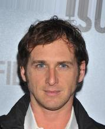
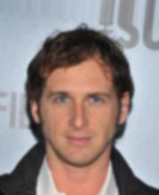
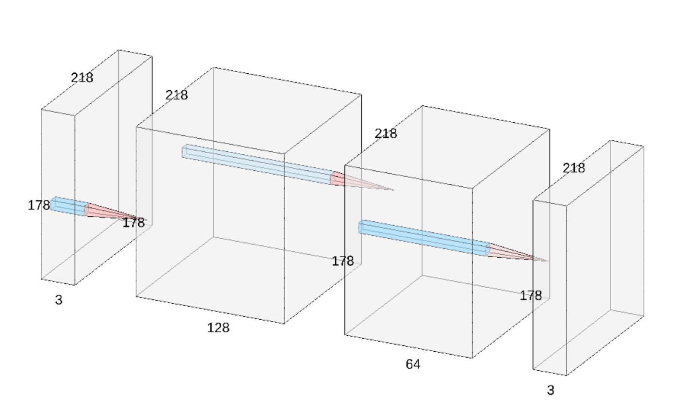
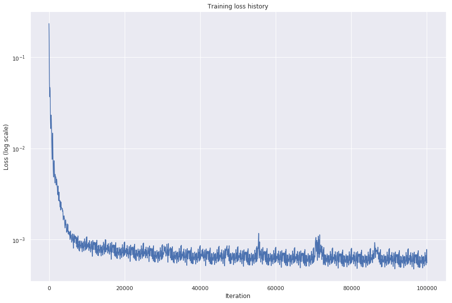

# SCC0251 Image Processing - Final Project

## Authors

* **Gustavo Sutter Pessurno de Carvalho** - *9763193* - [suttergustavo](https://github.com/suttergustavo)
* **Rodrigo Geurgas Zavarizz** - *9791080* - [rgeurgas](https://github.com/rgeurgas)
* **Victor Henrique de Souza Rodrigues** - *9791027* - [victorhenrique97](https://github.com/victorhenrique97)

**Running the demo**
```
python3 src/demo.py <IMG_PATH>
```
For more information on what which file does, instructions on how to run the programs and how to install the libraries check [here](RUNNING.md)

## Improving image upscaling quality with convolutional neural networks

### Abstract

The aim of this project is to use a machine learning approach to the image upscaling problem. Our goal is to develop a deep neural network capable of generating a higher resolution image given a low resolution sample, a process known as super resolution. Finally, once the method is implemented, we will compare our results with other approaches, such as bilinear and nearest neighbour interpolations.

### Dataset
The [CelebA Dataset](http://mmlab.ie.cuhk.edu.hk/projects/CelebA.html) [1] will be used to train and test our model. Although the dataset contains imagens and attributes information only the image data will be used. There are 202,599 images with dimension 218x178x3 that have already been aligned and cropped.

To performe the super resolution task this data is used to generate two datasets: one with high resolution (HR) and the other with low resolution (LR). The LR dataset is obtained by downscaling the original images by a factor of two, while the HR dataset contains the original images.


| Example HR| Example LR |
|--|--|
|  | |

### End-to-end super resolution neural network

As mentioned, the goal of this project is to build a convolutional neural network capable of increasing the quality of an image that is given as an input. The approach proposed is end-to-end, that is, the mapping from the LR image to the HR image is done only by the neural network. The only necessary pre-processing is to upscale the LR image to the desired size using an interpolation method. 

The following diagram demonstrates how this process works

<p align="center"> 
  
</p>

#### Neural network architecture

The network architecture used is fairly simple, containing only tree convoltutional layers, all with 3 x 3 kernels. The specific dimensios of each layer can be seen in the diagram that follows. The preliminary version did not use padding, however it was added to keep the same width and height from the input of the network to it's output.

<p align="center">
  
</p>

#### Preliminary results

The first version was implemented using Keras, aiming to be a test to see if it was possible to perform the task that was proprosed (This code can be found on this [notebook](notebooks/conv_net_approach.ipynb)).  In this stage we did not care about any metrics, just the visual of the generated images.

We have trained the network that was described using only 800 images (and without any data augmentation) for 50 epochs we were able to obtain the following results on the validation set:

<p align="center">
  
</p>

<p align="center">
  
</p>

As one may notice the results generated by the network tend to be less blurred than the ones produced by the linear interpolation algorithm.

### Implementing the final network

In order to have a more robust implementation th final version was develop using the Pytorch library. With Pytorch the programming the network and it's training was much easier and efficient, since it has a set of classes with different functionalities and it is compatible with GPUs. 

The first advantage was using creating a Dataset, a class the is used to dynamiclly load the images from the disk when they are needed, avoiding the need to load all the dataset on the memory. The Dataset (which is implemented on [celeba_dataset.py](src/celeba_dataset.py)) takes care of creating the LR image during execution, so there is no need to save a LR copy for every HR image on disk.

Pytorch high level interface for neural network development was also very useful to develop the project in a simple but yet well functional way. Just like other deep learning frameworks it allowed us to easily train our model, save it weights and used the learned parameters later on.

### Training the network

Because of computational constraints the the network was training using only 5000 images for 20 epochs, which may appear to be too small but in fact gives good results. The training of the network consisted on minimizing the mean squared error between the SR image produced by the network and the image used to generate the LR image, that is, the original image. To do so the Adam optimizer with a learning rate of 0.001 was used and converged to as demonstrated on the following graph.

<p align="center">
  
</p>

The decrease on the loss happenned quite fast, which might indicate that the learning rate used was to high. However even when smaller learning rates were used the same thing occured, so the hyperparameter was kept the same. 

### Results obtained


### Conclusion and future work


### References

[1] Z. Liu, P. Luo, X. Wang and X. Tang, "Deep Learning Face Attributes in the Wild," 2015 IEEE International Conference on Computer Vision (ICCV), Santiago, 2015, pp. 3730-3738.

[2] C. Dong, C. C. Loy, K. He and X. Tang, "Image Super-Resolution Using Deep Convolutional Networks," in IEEE Transactions on Pattern Analysis and Machine Intelligence, vol. 38, no. 2, pp. 295-307, 1 Feb. 2016.