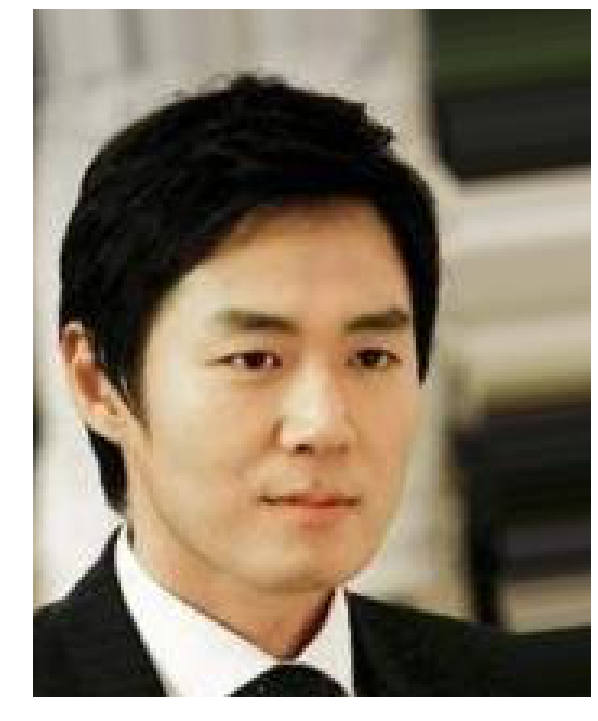
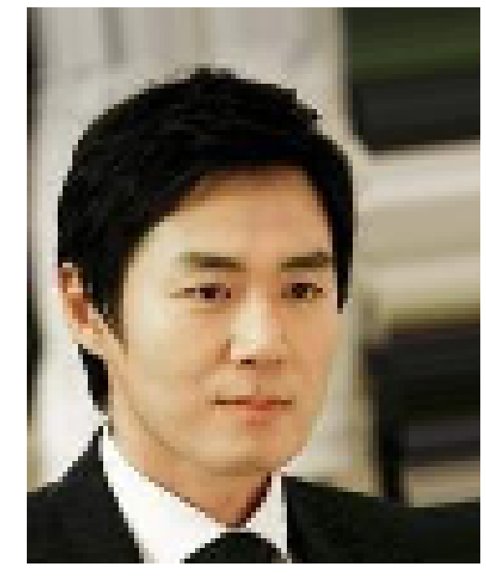
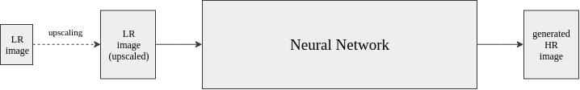
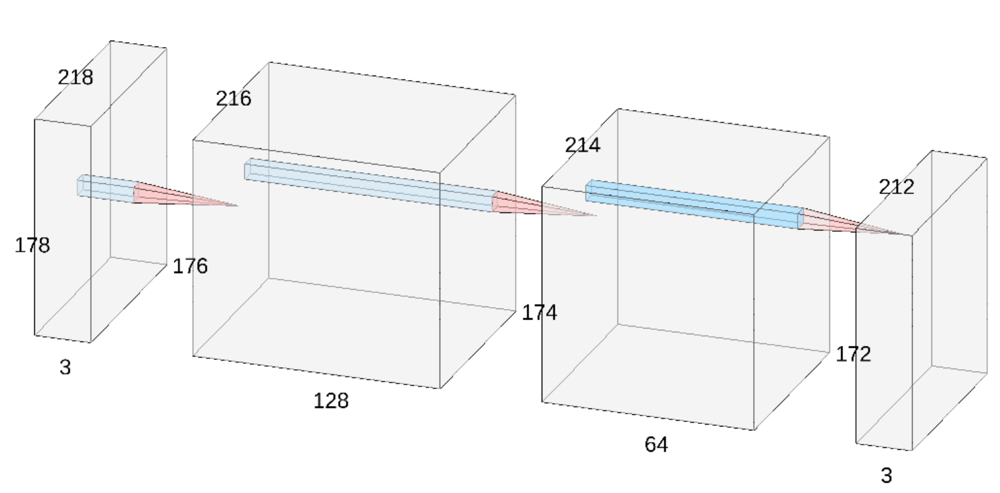
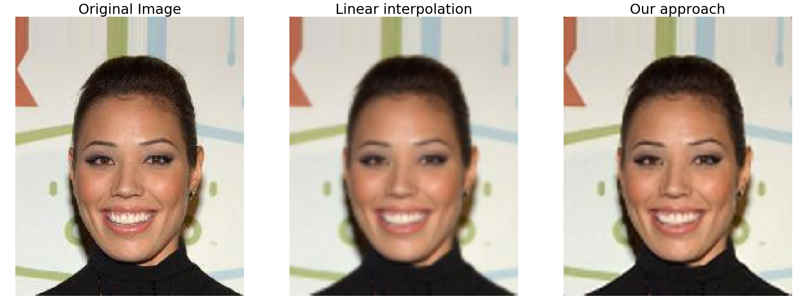
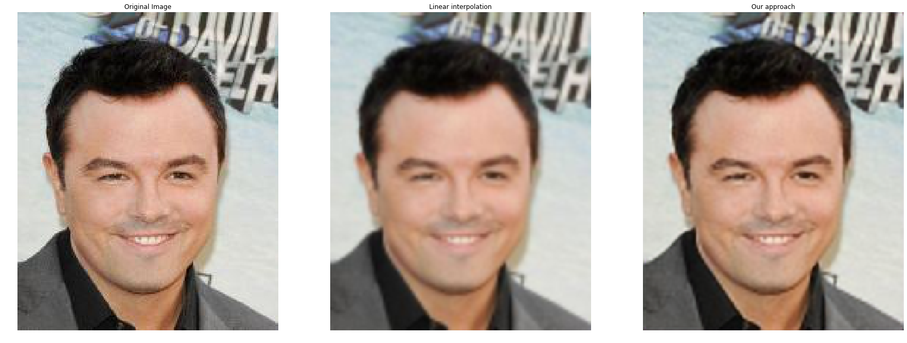

# SCC0251 Image Processing - Final Project

## Authors

* **Gustavo Sutter Pessurno de Carvalho** - *9763193* - [suttergustavo](https://github.com/suttergustavo)
* **Rodrigo Geurgas Zavarizz** - *9791080* - [rgeurgas](https://github.com/rgeurgas)
* **Victor Henrique de Souza Rodrigues** - *9791027* - [victorhenrique97](https://github.com/victorhenrique97)

## Improving image upscaling quality with convolutional neural networks

### Abstract

The aim of this project is to use a machine learning approach to the image upscaling problem. Our goal is to develop a deep neural network capable of generating a higher resolution image given a low resolution sample, a process known as super resolution. Finally, once the method is implemented, we will compare our results with other approaches, such as bilinear and nearest neighbour interpolations.

### Dataset
The [CelebA Dataset](http://mmlab.ie.cuhk.edu.hk/projects/CelebA.html) [1] will be used to train and test our model. Although the dataset contains imagens and attributes information only the image data will be used. There are 202,599 images with dimension 218x178x3 that have already been aligned and cropped.

To performe the super resolution task this data is used to generate two datasets: one with high resolution (HR) and the other with low resolution (LR). The LR dataset is obtained by downscaling the original images by a factor of two, while the HR dataset contains the original images.

| Example HR| Example LR |
|--|--|
|  | |

### End-to-end super resolution neural network

As mentioned, the goal of this project is to build a convolutional neural network capable of increasing the quality of an image that is given as an input. The approach proposed is end-to-end, that is, the mapping from the LR image to the HR image is done only by the neural network. The only necessary pre-processing is to upscale the LR image to the desired size using an interpolation method. 

The following diagram demonstrates how this process works

<p align="center"> 
  
</p>

#### Neural network architecture

The network architecture used is fairly simple, containing only tree convoltutional layers, all with 3 x 3 kernels. The specific dimensios of each layer can be seen in the diagram that follows

<p align="center">
  
</p>

#### Preliminary results

Training the network that was just described using only 800 images (and without any data augmentation) for 50 epochs we were able to obtain the following results on the validation set:

<p align="center">
  
</p>

<p align="center">
  
</p>

As one may notice the results generated by the network tend to be less blurred than the ones produced by the linear interpolation algorithm.

### References

[1] Z. Liu, P. Luo, X. Wang and X. Tang, "Deep Learning Face Attributes in the Wild," 2015 IEEE International Conference on Computer Vision (ICCV), Santiago, 2015, pp. 3730-3738.

[2] C. Dong, C. C. Loy, K. He and X. Tang, "Image Super-Resolution Using Deep Convolutional Networks," in IEEE Transactions on Pattern Analysis and Machine Intelligence, vol. 38, no. 2, pp. 295-307, 1 Feb. 2016.

## Getting Started

These instructions will get you a copy of the project up and running on your local machine for development and testing.

### Prerequisites

You have two options to run this program first is to run the notebooks, you could use Jupyter or [Colab](https://colab.research.google.com/) from Google the other option is to run the raw scripts. For Colab you won't need to download any prerquisite. For the other options you will first need Python and [CUDA](https://developer.nvidia.com/cuda-10.0-download-archive).

To install via terminal
```
sudo apt-get install python3
```
you can also download it [here](https://www.python.org/downloads/)

Then you will need these packages to run everything
```
# numpy
sudo pip3 install numpy
# kaggle
sudo pip3 install kaggle
# pytorch
sudo pip3 install torch
# torchvision
sudo pip3 install torchvision
# matplotlib
sudo pip3 install matplotlib
# scikit-image
sudo pip3 install scikit-image
# PIL
sudo pip3 install pillow
```

At last you will need Jupyter if you will run the notebooks.
```
sudo pip3 install jupyter
```

### Installing

Download the repository from Github and you are good to go.

## Running the tests

Open the notebook [conv_net_approach.ipynb](notebooks/conv_net_approach.ipynb) on your environment or run the script [train.py](src/train.py) to train the model.

## Contributing

Please read [CONTRIBUTING.md](CONTRIBUTING.md) for details on our code of conduct, and the process for submitting pull requests to us.

## License

This project is licensed under the MIT License - see the [LICENSE](LICENSE) file for details
